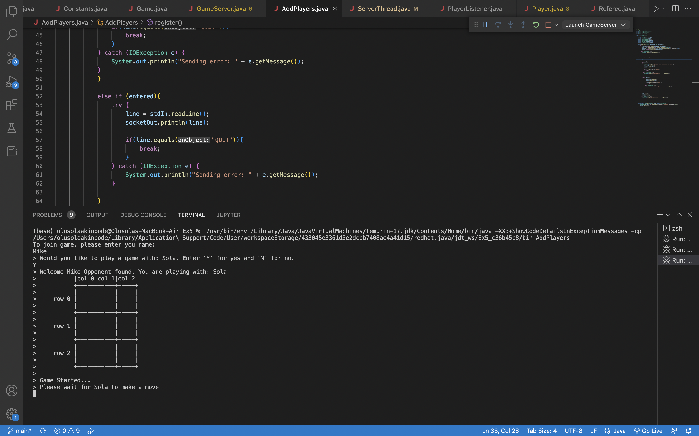
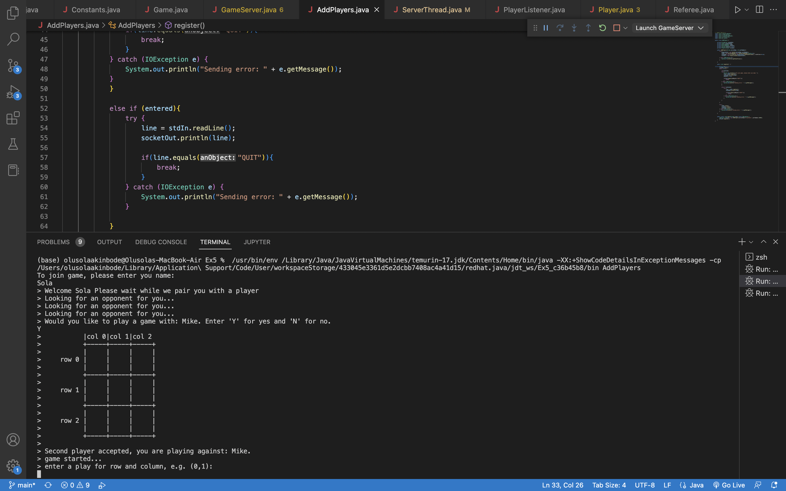
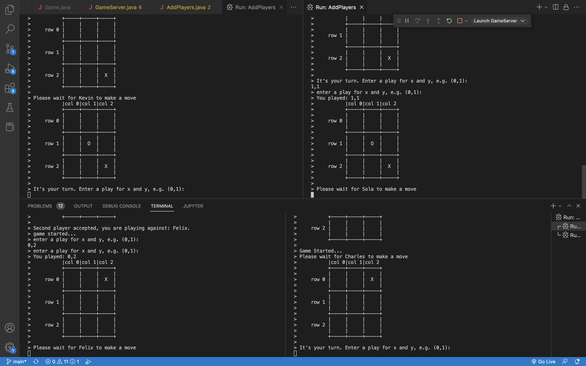

# TicTacToe-with-Multithreading

TicTacToe two game player with multithreading. Two players are able to play a game through sockets connections between two independent clients and a single server. Multiple pairs of games can go on simultaniously. 

Pictures of games in progress are shown below:

Execution1: 
Execution2: 
Execution3: 